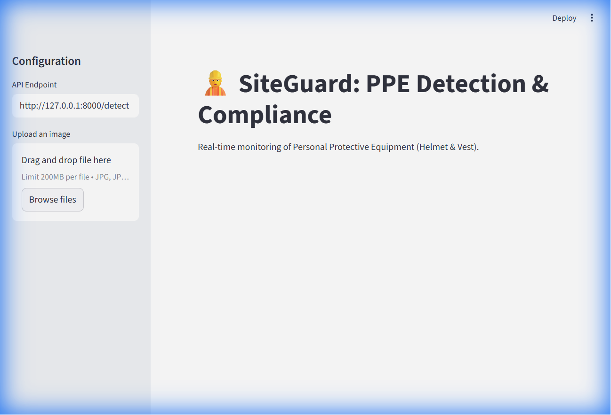
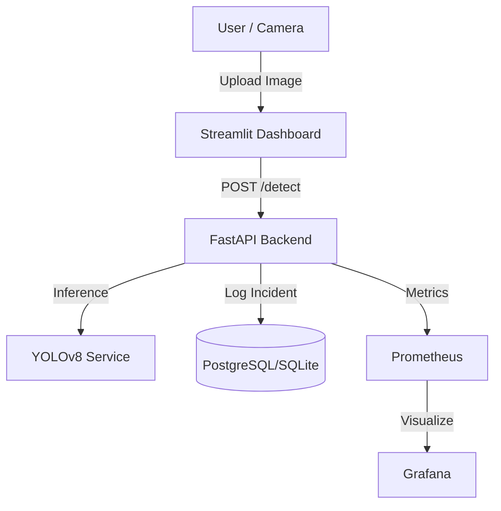

# 👷 SiteGuard: AI-Powered PPE Detection System


**SiteGuard** is an automated computer vision system designed to enhance safety in industrial environments. It detects workers and verifies compliance with Personal Protective Equipment (PPE) regulations (Helmets and High-Visibility Vests) in real-time.



---

## 🚀 Why SiteGuard?

- **Safety First**: Automatically identifies workers at risk, preventing accidents before they happen.
- **Real-Time Alerts**: Generates instant notifications for non-compliance.
- **Scalable Architecture**: Built with microservices (FastAPI, Docker) and MLOps best practices.

---

## 🛠️ Architecture

The system follows a modern microservices architecture:



## 🤖 MLOps Pipeline

We don't just ship code; we ship quality. Our CI/CD pipeline ensures that every change is tested and validated.

1.  **Code Quality**: `ruff` and `pre-commit` hooks ensure PEP8 compliance.
2.  **Automated Testing**: `pytest` verifies API functionality.
3.  **Continuous Machine Learning (CML)**:
    *   On every Pull Request, the model is evaluated against a test set.
    *   Metrics (Precision, Recall) and Confusion Matrices are reported automatically by a bot.
4.  **Continuous Deployment (CD)**:
    *   If tests pass, a Docker image is built and pushed to the container registry.

## ⚡ Quick Start (Windows)

We have created an automated script to handle everything for you.

### Prerequisites
- **Python 3.10+** (Added to PATH)
- **Node.js** (LTS version)
- **NVIDIA GPU Users**: For Real-Time acceleration, ensure you have:
  - NVIDIA Drivers installed
  - CUDA Toolkit 12.1 (Compatible with PyTorch)

### One-Click Launcher
We have created a master script to handle everything for you with a simple menu.

1.  **Run the script**
    ```powershell
    .\start_siteguard.ps1
    ```
    
2.  **Select a Mode:**
    *   **Option 1: Public Server Mode**: Starts Backend + ngrok tunnel. Use this to serve the backend for the public Vercel frontend.
    *   **Option 2: Local Developer Mode**: Starts Backend + Local Frontend. Use this for development.

3.  **Access the Application**
    *   **Public (Vercel)**: `https://siteguard.vercel.app` (Requires Option 1)
    *   **Local**: `http://localhost:5173` (Requires Option 2)
    *   **API Docs**: `http://localhost:8000/docs`

2.  **Access the Application**
    *   **Frontend**: [http://localhost:5173](http://localhost:5173)
    *   **API Docs**: [http://localhost:8000/docs](http://localhost:8000/docs)

### Manual Setup (If script fails)

1.  **Backend**
    ```powershell
    # Install dependencies (GPU version)
    pip install torch torchvision torchaudio --index-url https://download.pytorch.org/whl/cu121
    pip install -r requirements.txt
    
    # Run Migrations
    $env:DATABASE_URL="sqlite+aiosqlite:///./siteguard.db"; python -m alembic upgrade head

    # Start API (Note the module path app.app.main)
    $env:DATABASE_URL="sqlite+aiosqlite:///./siteguard.db"; python -m uvicorn app.app.main:app --reload --port 8000
    ```

2.  **Frontend**
    ```powershell
    cd frontend-react
    npm install
    npm run dev
    ```

## 📂 Project Structure

```
.
├── app/                # FastAPI Backend
├── frontend-react/     # React Frontend (Vite)
├── ml/                 # Model Training & Evaluation
├── docker/             # Dockerfiles
├── tests/              # Automated Tests
├── .github/workflows/  # CI/CD & CML Pipelines
└── siteguard.db        # SQLite Database
```

---
*Built with ❤️ by [Your Name]*
