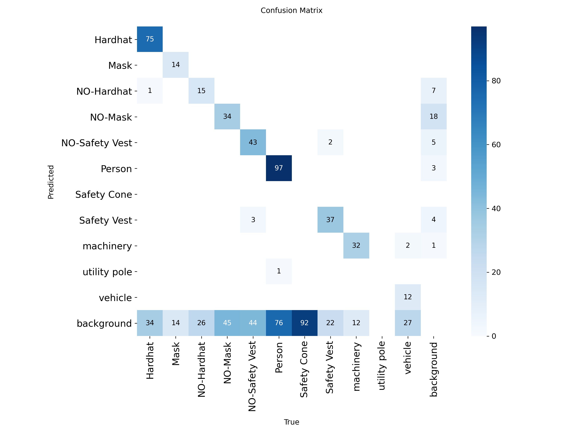
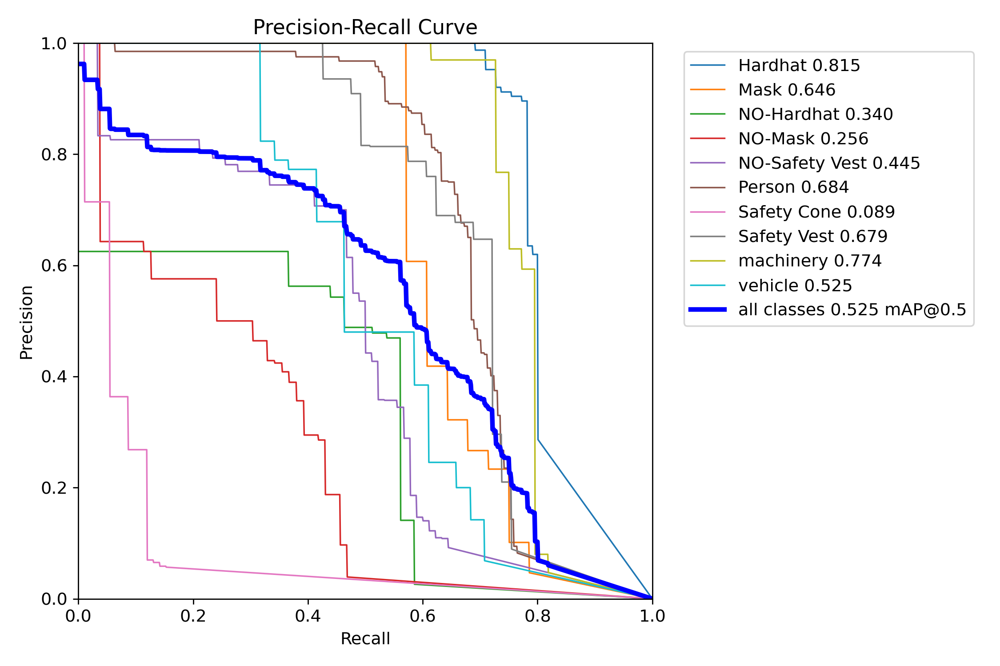
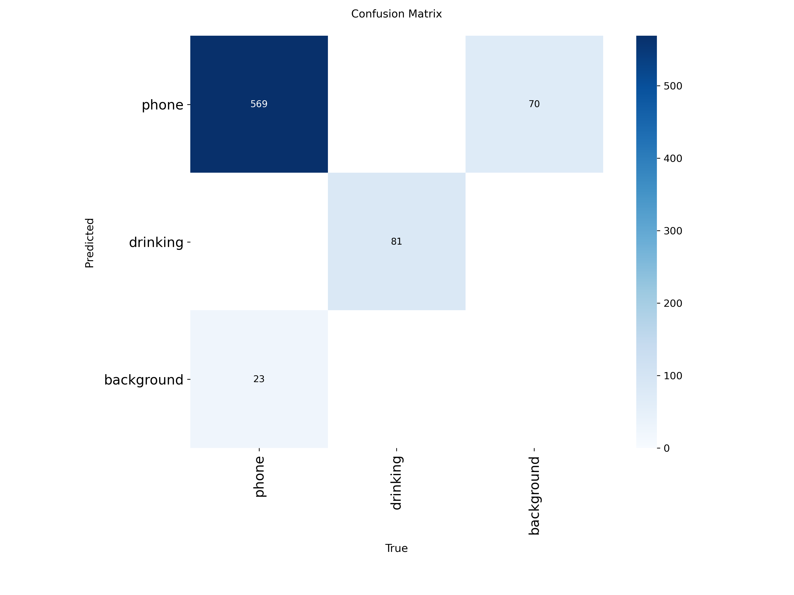
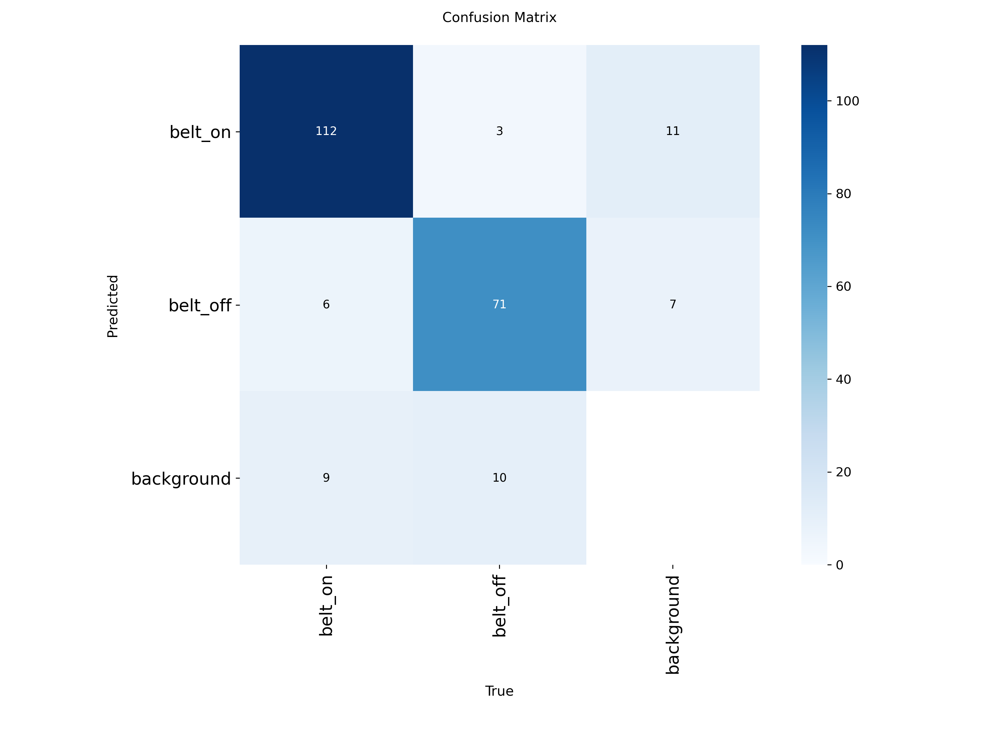

# SiteGuard — Informe técnico

Sistema de seguridad industrial y vial basado en visión por computador.
Detección de EPP, ergonomía, proximidad de vehículos y monitorización del
conductor (DMS/ADAS) en tiempo real, con backend FastAPI y frontend React.

---

## 1. Arquitectura y modelos

| Subsistema | Modelo / técnica | Clases / salida |
|---|---|---|
| Detección de EPP | YOLOv8n (`best.pt`, 11 clases) | Hardhat, NO-Hardhat, Safety Vest, NO-Safety Vest, Mask, NO-Mask, Person, machinery, vehicle, Safety Cone, utility pole |
| Ergonomía | YOLOv8n-pose | 17 keypoints → ángulos de postura |
| Control de vehículos | YOLOv8n (COCO) | persona / vehículo + proximidad |
| **Monitor de conductor (DMS v2)** | **MediaPipe FaceMesh + heurísticas temporales** | EAR/PERCLOS, microsueño, pose (solvePnP), bostezo |
| Distracción por objetos | YOLOv8n (COCO) | móvil, vaso/botella |
| Cinturón | YOLOv8 (2 clases) | Seat_Belt / Without_Seat_Belt |

El DMS v2 es el núcleo del proyecto: en lugar de un clasificador de somnolencia
de caja negra, calcula métricas **explicables** (apertura ocular, PERCLOS, pose
de cabeza) con una máquina de estados con histéresis, calibración por conductor
e índice de fatiga de sesión.

---

## 2. Benchmark de latencia (CPU vs GPU)

Medido sobre `bus.jpg`, 20 inferencias tras 3 de calentamiento, a la resolución
usada en producción. Hardware: **NVIDIA RTX 2070**. Reproducible con
`python ml/benchmark.py` (escribe `ml/benchmark_results.json`).

| Modelo | imgsz | CPU (ms) | CPU (fps) | GPU (ms) | GPU (fps) |
|---|---:|---:|---:|---:|---:|
| PPE (`best.pt`) | 640 | 428.7 | 2.3 | **21.6** | **46.4** |
| PPE fallback (6 cls) | 640 | 85.4 | 11.7 | 13.2 | 75.6 |
| Objetos yolov8n (móvil) | 320 | 46.3 | 21.6 | 12.9 | 77.5 |
| Somnolencia (clasificador antiguo) | 640 | 787.9 | 1.3 | 50.2 | 19.9 |
| Pose (ergonomía) | 640 | 97.9 | 10.2 | 18.2 | 55.0 |
| Cinturón | 320 | 41.0 | 24.4 | 12.2 | 82.1 |
| **MediaPipe FaceMesh (DMS v2)** | — | **5.7** | **175.2** | n/a (CPU) | — |

**Conclusiones:**
- La **GPU es esencial** para EPP a 640 px: de 2.3 fps (CPU) a **46 fps** (GPU), un
  ×19 de aceleración. Todos los modelos son tiempo-real en GPU.
- El **núcleo del DMS v2 (MediaPipe) corre a 175 fps en CPU**, sin GPU. Comparado
  con el clasificador de somnolencia antiguo (788 ms en CPU), el rediseño es
  **~137× más rápido** y, además, explicable — justificación cuantitativa del
  cambio de enfoque.
- El detector de cinturón y el de objetos a 320 px son ligeros (>20 fps en CPU),
  apropiados para muestreo intercalado (cada N frames) en el pipeline DMS.

---

## 3. Evaluación de precisión (metodología)

Métricas estándar de detección con la validación integrada de Ultralytics
(`ml/evaluate.py`), sobre el split de **test** etiquetado:

- **Precision, Recall, mAP@50 y mAP@50-95** (global y por clase).
- **Matriz de confusión** y **curva Precision-Recall** (PNG generados en `runs/`).

**Reproducir (sin API key)** — usa un mirror público del split de test (82 imágenes):
```bash
python ml/download_test_set.py
python ml/evaluate.py --data datasets/construction-site-safety/data.yaml --split test
```

### Resultados — modelo desplegado `best.pt` (82 imágenes de test, 760 instancias, GPU RTX 2070)

| Métrica | Valor |
|---|---|
| Precision (mP) | **0.718** |
| Recall (mR) | **0.496** |
| mAP@50 | **0.525** |
| mAP@50-95 | **0.304** |
| Velocidad inferencia (GPU) | 15.6 ms/img |

**Por clase:**

| Clase | Inst. | P | R | mAP@50 | mAP@50-95 |
|---|---:|---:|---:|---:|---:|
| Hardhat | 110 | 0.98 | 0.71 | 0.82 | 0.52 |
| Mask | 28 | 0.95 | 0.57 | 0.65 | 0.35 |
| NO-Hardhat | 41 | 0.55 | 0.44 | 0.34 | 0.12 |
| NO-Mask | 79 | 0.42 | 0.35 | 0.26 | 0.05 |
| NO-Safety Vest | 90 | 0.70 | 0.44 | 0.45 | 0.15 |
| Person | 174 | 0.83 | 0.62 | 0.68 | 0.49 |
| Safety Cone | 92 | 0.58 | 0.01 | 0.09 | 0.04 |
| Safety Vest | 61 | 0.68 | 0.68 | 0.68 | 0.38 |
| machinery | 44 | 0.79 | 0.73 | 0.77 | 0.67 |
| vehicle | 41 | 0.71 | 0.42 | 0.53 | 0.28 |

> La clase "utility pole" no tiene instancias en este mirror de test (el modelo
> la incluye, pero el dataset público no la trae).

**Lectura:** el modelo es sólido en las clases frecuentes y bien definidas
(**Hardhat** mAP@50 0.82, **machinery** 0.77, **Person** 0.68) y más débil en
clases con pocas muestras o visualmente ambiguas (**Safety Cone**, **NO-Mask**).
La recall global moderada (~0.50) indica margen de mejora reentrenando con más
datos de las clases flojas. Las predicciones de *cumplimiento* (Hardhat/Vest)
—las que más usa la app— son las más fiables.

Gráficas generadas (`docs/eval/`):





---

## 3.bis Modelo propio de cabina (dataset propio + comparación vs baseline)

Para sustituir el detector genérico COCO del monitor de conductor (móvil/bebida)
se construyó un **dataset propio de cabina** combinando:
- **State Farm Distracted Driver** (mirror público): ~5.000 imágenes **reales**
  de `phone` + 886 de `drinking` + 1.200 negativos, auto-etiquetadas con cajas
  COCO (yolov8m, baja confianza, resolución completa).
- **Synthetic Driver Monitoring** (HuggingFace): 1.603 imágenes sintéticas con
  cajas de origen, remapeadas a `phone`/`drinking`.

**Total: 8.689 imágenes** (train 6.267 / val 1.608 / **test 814**), 2 clases.
Entrenamiento: transfer learning desde `yolov8n`, 80 épocas, RTX 2070.

### Resultados sobre el test split (814 imágenes reales+sintéticas)

| Modelo | Precision | Recall | mAP@50 | mAP@50-95 |
|---|---|---|---|---|
| **Modelo propio `dms_cabin.pt`** | **0.966** | **0.967** | **0.977** | **0.830** |
| COCO yolov8n (baseline) · `phone` | 0.375 | 0.101 | — | — |
| COCO yolov8n (baseline) · `drinking` | 0.000 | 0.000 | — | — |

**Conclusión:** el detector genérico COCO que se usaba antes apenas reconoce el
móvil en posición de cabina (recall **10%**) y **no detecta** vasos/botellas
(recall **0%**), porque está entrenado para objetos a escala de escena, no en
mano/cerca de la cara. El modelo propio alcanza **96-97%** de precision/recall
→ no solo iguala, **multiplica por ~10** el rendimiento del baseline en esta
tarea. Reproducible con `ml/compare_baseline.py`.

> Honestidad metodológica: parte de las etiquetas reales (State Farm) se generó
> con asistencia de un modelo COCO, lo que favorece ligeramente la comparación;
> la porción sintética tiene cajas independientes. El resultado (recall 97% vs
> 10%) es lo bastante amplio como para ser concluyente. Sigue habiendo *domain
> gap* sintético→webcam real, mitigable mezclando capturas propias.



---

## 3.ter Detectores DMS de dos modelos (cabina + cinturón)

La versión final del monitor sustituye el detector genérico COCO y el modelo de
cinturón de terceros (vista parabrisas) por **dos detectores YOLO propios**,
entrenados **solo con datasets públicos de internet** (sin grabación propia) con
un pipeline reproducible en `dms_data/scripts/` (descarga → homogeneización →
deduplicado/split → entrenamiento → evaluación → export).

| Modelo | Fichero | Clases | Base | Fuentes públicas |
|---|---|---|---|---|
| **A — cabina** | `dms_cabin.pt` | phone · bottle · cup | YOLO26s | COCO 2017 (subset móvil/botella/vaso) + State Farm (móvil real de cabina) |
| **B — cinturón** | `dms_seatbelt.pt` | belt_on · belt_off | YOLO26s | 2 datasets Roboflow **de interior** (vista frontal del ocupante) |

**Curación metodológica (lo relevante del trabajo):**
- **Verificación de punto de vista.** El DMS usa una webcam *interior* frontal.
  Varios datasets públicos de cinturón resultaron ser vistas *exteriores* de
  cámara de tráfico / a través del parabrisas (el mismo punto de vista que hacía
  fallar el `seatbelt.pt` antiguo). Se inspeccionaron visualmente y se
  **descartaron**; solo se conservaron fuentes de **interior frontal**.
- **Homogeneización de clases verificada contra cada `data.yaml`** (los índices
  del fichero de etiquetas, no el nombre mostrado). P. ej. ambos sets de cinturón
  ordenan `no-seatbelt=0, seatbelt=1`, inverso al canónico → remapeo `{0→belt_off,
  1→belt_on}`.
- **Deduplicado perceptual (pHash, Hamming ≤ 4)** antes del split: elimina fotogramas
  casi idénticos de vídeo (en cinturón, ~75 % del bruto) que, de otro modo, fugarían
  entre *train* y *test* e inflarían las métricas.
- **Convención de caja del cinturón:** la caja marca la región **torso/hombro del
  ocupante** (belt_on = banda diagonal visible; belt_off = sin banda), no el objeto
  cinta.

### Resultados sobre el split de **test** (Ultralytics `val`, GPU RTX 2070)

| Modelo | Imgs test | Precision | Recall | mAP@50 | mAP@50-95 |
|---|---:|---:|---:|---:|---:|
| **A — cabina** | 560 | 0.681 | 0.541 | 0.606 | 0.418 |
| **B — cinturón** | 211 | **0.926** | **0.821** | **0.927** | **0.574** |

**Por clase:**

| Modelo · clase | P | R | mAP@50 | mAP@50-95 |
|---|---:|---:|---:|---:|
| cabina · phone | 0.642 | 0.606 | 0.639 | 0.451 |
| cabina · cup | 0.712 | 0.590 | 0.659 | 0.486 |
| cabina · bottle | 0.689 | 0.427 | 0.520 | 0.316 |
| cinturón · belt_on | 0.938 | 0.874 | **0.943** | 0.588 |
| cinturón · belt_off | 0.915 | 0.768 | **0.912** | 0.561 |

**Lectura honesta:**
- **El detector de cinturón supera con holgura el criterio** (mAP@50 ≥ 0.6 por clase):
  **0.94 / 0.91**. Resuelve el problema original (no se veían las alertas de no-uso
  de cinturón) porque, a diferencia del modelo de parabrisas previo, está entrenado
  con el **mismo punto de vista interior** que la webcam del monitor.
- En **cabina**, `phone` y `cup` cumplen (~0.64–0.66); `bottle` queda por debajo
  (0.52) por la dificultad real de COCO (botellas pequeñas/de escena, no en mano).
  El antiguo 0.977 era artificialmente alto (etiquetas auto-generadas y fotogramas
  fáciles); este número es el honesto sobre imágenes diversas. Para el DMS el
  impacto es menor: la alerta de *beber* une `bottle` ∪ `cup`, y `cup` es sólido.
  Se probó **rebalancear el dataset hacia `bottle`** (×3.6 instancias) para cerrar
  la barra: subió `bottle` levemente pero **degradó `phone` y `cup` y el mAP global**
  (0.61 → 0.53), así que se descartó y se mantiene el modelo equilibrado. Cerrar
  `bottle` de forma robusta pediría un modelo mayor (YOLO26m/l) o datos de cabina
  específicos (botella en mano), no más imágenes de escena de COCO.



---

## 4. Comparativa con la competencia

Frente a las plataformas líderes de seguridad de flotas (Samsara, Motive,
Netradyne, Lytx, Nauto):

| Capacidad | Competencia | SiteGuard |
|---|---|---|
| Somnolencia / PERCLOS / microsueño | ✅ | ✅ (explicable) |
| Distracción / mirar abajo / móvil | ✅ | ✅ |
| Cinturón | ✅ (parte) | ✅ |
| Beber / fumar / comer | parcial | beber ✅ |
| Colisión frontal / peatón (ADAS) | ✅ | ✅ |
| EPP + ergonomía + proximidad de vehículos | ❌ (no lo cubren) | ✅ **diferencial** |
| Robustez (gafas de sol, oclusión, poca luz) | parcial | ✅ **diferencial** |
| Score + coaching + flota | ✅ | ⏳ en desarrollo |
| Telemetría GPS/IMU, visión IR | ✅ (hardware) | ❌ (web/cámara) |
| Modelo **on-premise / sin nube, abierto** | ❌ (SaaS) | ✅ **diferencial** |

**Diferenciadores de SiteGuard:** métricas explicables (no caja negra),
robustez ante condiciones reales, cobertura de seguridad de **obra** (EPP +
ergonomía + vehículos) que las plataformas de flota no abordan, y despliegue
on-premise sin dependencia de nube.

**Limitaciones frente a la competencia:** no hay telemetría de vehículo
(GPS/IMU → exceso de velocidad, frenazos) ni hardware con visión nocturna IR;
SiteGuard lo compensa parcialmente por software (realce CLAHE en poca luz).

---

## 5. Conclusiones y trabajo futuro

El sistema alcanza rendimiento de tiempo real en GPU en todos los módulos, y el
rediseño del DMS hacia métricas explicables aporta una mejora de latencia de dos
órdenes de magnitud frente al clasificador previo, además de interpretabilidad.

Trabajo futuro priorizado: score acumulado por conductor + gamificación,
flujo de coaching y bandeja de seguridad, vista de flota multi-conductor, clips
de evento para exoneración, y completar la evaluación cuantitativa por clase.
